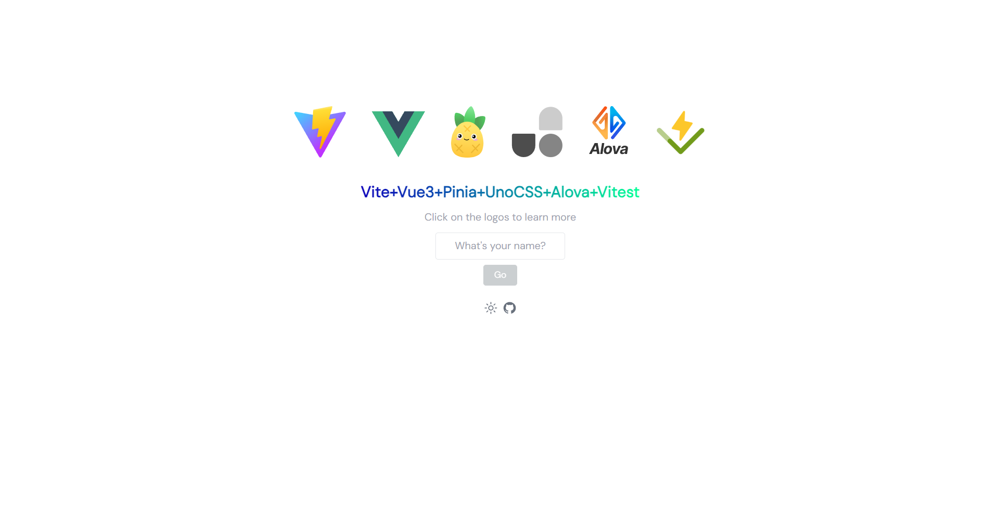

# Vue3+Vite+Alova+TS



<p align="center">
  <a href="https://vitesse-star.netlify.app/" target="_blank">
  👀 在线预览
  </a>|
  <a href="https://github.com/ileostar/vitesse-star#%EF%B8%8F%E5%BF%AB%E9%80%9F%E5%BC%80%E5%A7%8B">
  ✌️ 快速开始
  </a>
</p>

## 🏆特性

- 🦄使用 Vite 构建工具快速构建项目
- 🛠️集成 Vue DevTools，可视化项目，助力开发和测试
- 🥑使用 ESLint、Stylelint 代码规范保证代码质量
- 📦拆箱即用，结合了 Vue3、Vite、Alova 和 TypeScript
- 🕸自动配置路由，使用 unplugin-vue-router 插件自动生成路由
- 🥝自动引入，使用 unplugin-auto-import 插件实现组件自动引入
- ✨集成 UnoCSS，提供轻量级的样式解决方案
- 👀使用 Onu UI，一个基于UnoCSS的UI组件库
- 🍀集成 Vitest，用于项目的单元测试
- 🧰使用 VueUse 函数库辅助开发
- 🙈使用 Alova 实现网络请求
- 🍍使用 Pinia 进行状态管理
- 📌使用 husky、lint-staged 规范git commit
- 🍉使用 dezaper 分析依赖库

## 📚学习

### 架构相关

- [Vue.js - The Progressive JavaScript Framework | Vue.js (vuejs.org)](https://vuejs.org/)
- [Vite | Next Generation Frontend Tooling (vitejs.dev)](https://vitejs.dev/)

### 插件

- [unplugin-auto-import](https://github.com/unplugin/unplugin-auto-import)
- [vite-plugin-pages](https://github.com/posva/vite-plugin-pages)
- [vite-plugin-components](https://github.com/antfu/vite-plugin-components)
- [vite-plugin-vue-devtools](https://github.com/webfansplz/vite-plugin-vue-devtools)
- [pinia-auto-refs](https://github.com/Allen-1998/pinia-auto-refs)
- [dezaper](https://github.com/depazer/depazer)

### 状态管理

- [Pinia | The intuitive store for Vue.js (vuejs.org)](https://pinia.vuejs.org/zh/)

### 网络请求

- [Alova.JS - 轻量级请求策略库 | Alova.JS](https://alova.js.org/zh-CN/)

### UI & CSS

- [UnoCSS 中文文档 (alfred-skyblue.github.io)](https://alfred-skyblue.github.io/)
- [Onu UI 基于UnoCSS的组件库](https://onu.zyob.top/)

### 工具函数

- [VueUse中文文档 | VueUse中文文档 (vueusejs.com)](http://www.vueusejs.com/)

### 规范相关

- [🐶 husky | 🐶 husky (typicode.github.io)](https://typicode.github.io/husky/)
- [lint-staged: 🚫💩 — Run linters on git staged files (github.com)](https://github.com/okonet/lint-staged)
- [检测并修复 JavaScript 代码中的问题。 - ESLint - 插件化的 JavaScript 代码检查工具](https://zh-hans.eslint.org/)
- [Home | Stylelint中文文档 | Stylelint中文网](https://www.stylelint.com.cn/)
- [Commitizen by commitizen](https://github.com/commitizen/cz-cli)
- [cz-emoji git commit emoji Message](https://github.com/ngryman/cz-emoji)

### 单元测试

- [Vitest 下一代测试框架](https://cn.vitest.dev/)

## 🔔项目介绍

该项目是一个基于 Vue3、Vite 和 TypeScript 的脚手架模板，集成了 Alova 网络请求库和 Pinia 状态管理库，组件库采用Onu-UI。它旨在提供一个快速搭建 Vue3 项目的起点，同时也使用了一些优秀的第三方插件和库，以提高开发效率和项目质量。

## ✌️快速开始

克隆项目到本地：

``` bash
npx degit ileostar/vitesse-star 你的项目名称  # If there is no npx, npm i -g npx first
```

进入项目目录：

``` bash
cd 你的项目名称
```

安装依赖：

``` bash
pnpm install # If there is no pnpm, npm i -g pnpm first
```

启动开发服务器：

``` bash
pnpm dev
```

打开浏览器，访问 <http://localhost:3891> 即可查看项目运行效果。

## 📝目录结构

```text
├── github                // 存放github的workfow
├── .husky                // git hook预处理
├── .vscode               // vscode的配置
│   ├── extensions.json   // 插件设置
│   ├── setting.json      // IDE设置
├── public
│   ├── vite.svg          // 网站logo
├── src
│   ├── api               // 接口目录，使用alova接口函数
│   ├── assets            // 静态资源文件夹，如图片、字体等
│   ├── components        // 组件目录
│   ├── composables       // 存放状态逻辑的函数
│   ├── helper            // pinia-auto-refs插件自动生成目录
│   ├── pages             // 视图目录，存放页面级组件
│   ├── store             // Vuex状态管理文件夹
│   ├── styles            // 样式文件夹，存放全局样式和公共样式
│   ├── App.vue           // 根组件
│   └── main.ts           // 项目入口文件
├── test                  // 单元测试
├── .editorconfig         // IDE配置文件
├── .gitignore            // git忽略文件
├── .npmrc                // npm管理配置
├── .stylelintrc.json     // stylelintrc文件
├── .env                  // 配置环境
├── .env.pro              // 生产配置环境
├── .env.dev              // 开发配置环境
├── index.html            // 项目页面入口
├── myenv.d.ts            // 环境声明文件
├── netlify.toml          // netlify部署配置
├── .eslintignore         // ESLint忽略文件
├── .eslintrc.json        // ESLint配置文件
├── package.json          // 项目依赖配置文件
├── shims.d.ts            // 声明文件
├── README.md             // 项目说明文件
├── tsconfig.ts           // TS配置文件
├── tsconfig.node.ts      // TS-Node配置文件
├── uno.config.ts         // ESLint配置文件
└── vite.config.ts        // Vite项目配置文件
```

## ⚙️配置文件

### 读取配置

默认读取顺序`.env.dev/.env.pro > .env`

开发环境下可以在`.env.dev`修改需要配置

生成环境下可以在`.env.pro`修改需要配置

### 添加配置项

需要以VITE开头，如果在src中用可以使用`import.meta.env.<配置项>`,在`vite.config.ts`中用，这里用的是`dotenv`读取文件，需要在`./myenv.d.ts`文件下添加TS接口，才会有提示。

## 🤖代码规范

该项目使用 ESLint 来保证代码规范一致性。你可以在 .eslintrc.json 文件中查看相关配置。在提交代码时，将会自动进行代码规范检查。

## 🌐网络请求Alova

该项目使用 Alova 插件来发送网络请求，下面是使用文档。

[项目使用Alova文档参考](./src/api/README.md)

## 🎇配置路由

该项目使用  vite-plugin-pages 插件来自动生成路由配置。详细的使用方法请参考插件文档。

## 🐹自动引入

### 自动引入工具函数

该项目使用 unplugin-auto-import 插件来实现组件的自动引入，你可以在 vite.config.ts 中修改自动引入的规则和配置。

### 自动引入组件

该项目使用 vite-plugin-components 插件来实现组件的自动引入，**即定义组件直接使用即可，无需手动引入**，你可以在 vite.config.ts 中修改自动引入的规则和配置。

## 🍍状态管理

该项目使用 Pinia 进行状态管理。你可以在 src/stores 目录下创建自己的状态模块，并在需要的组件中引入并使用它们。

这里使用了[pinia-auto-refs](https://github.com/Allen-1998/pinia-auto-refs)插件简化引入

**使用插件前：**

```ts
import useUserStore from '@/store/user'

const userStore = useUserStore()
const { name, token, fullName } = storeToRefs(userStore)
const { updateName } = userStore
```

**使用插件后：**

```ts
const { name, token, fullName, updateName } = useStore('user')
```

## 🍉依赖分析

该项目使用 depazer 进行依赖分析，可视化依赖库，方便学习。

项目启动后可以<http://localhost:3891/__depazer>查看当前项目依赖。

## 🐛运行测试

该项目集成了 Vitest 单元测试工具。你可以在 test 目录下编写和运行测试用例。详细的使用方法请参考 Vitest 文档。

## 💖贡献

如果你发现任何问题或有改进建议，请随时提交 Issue 或 Pull Request。我们欢迎并感谢你的贡献！

以上是一个简单的示例，你可以根据实际情况添加或修改内容。希望能对你有所帮助！
